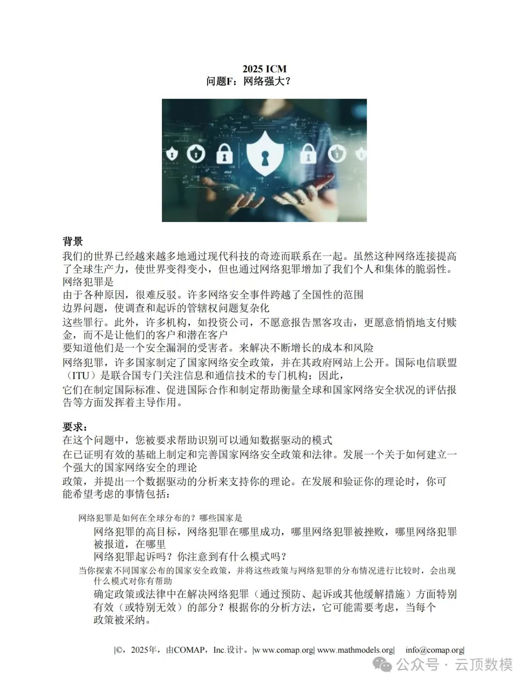
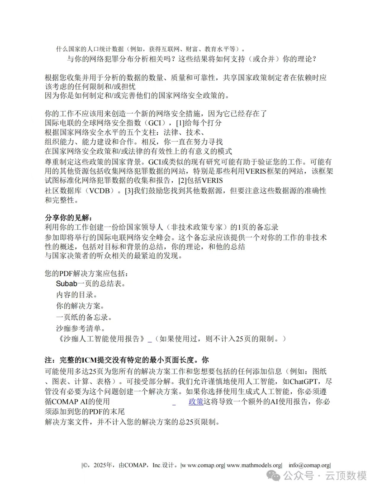
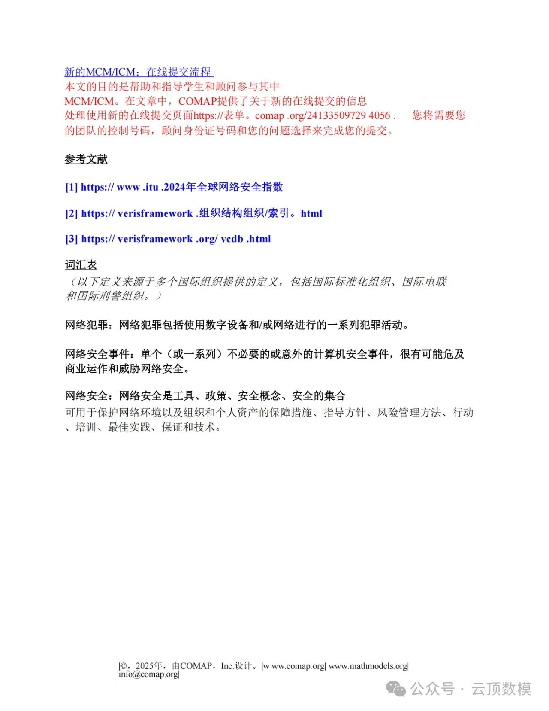
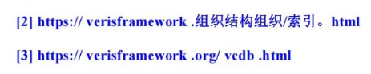
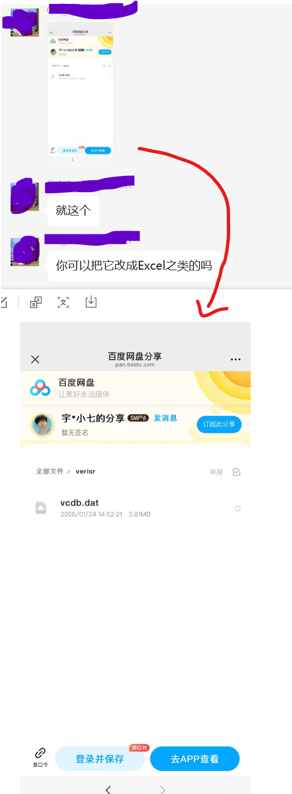
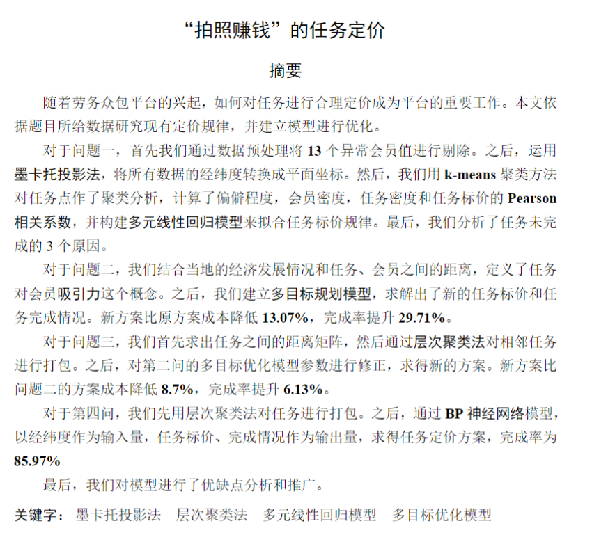
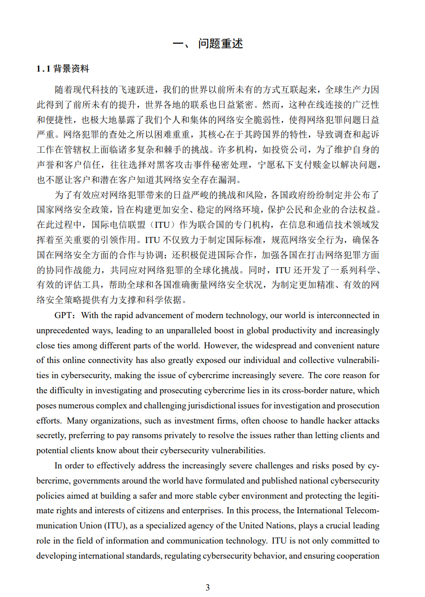
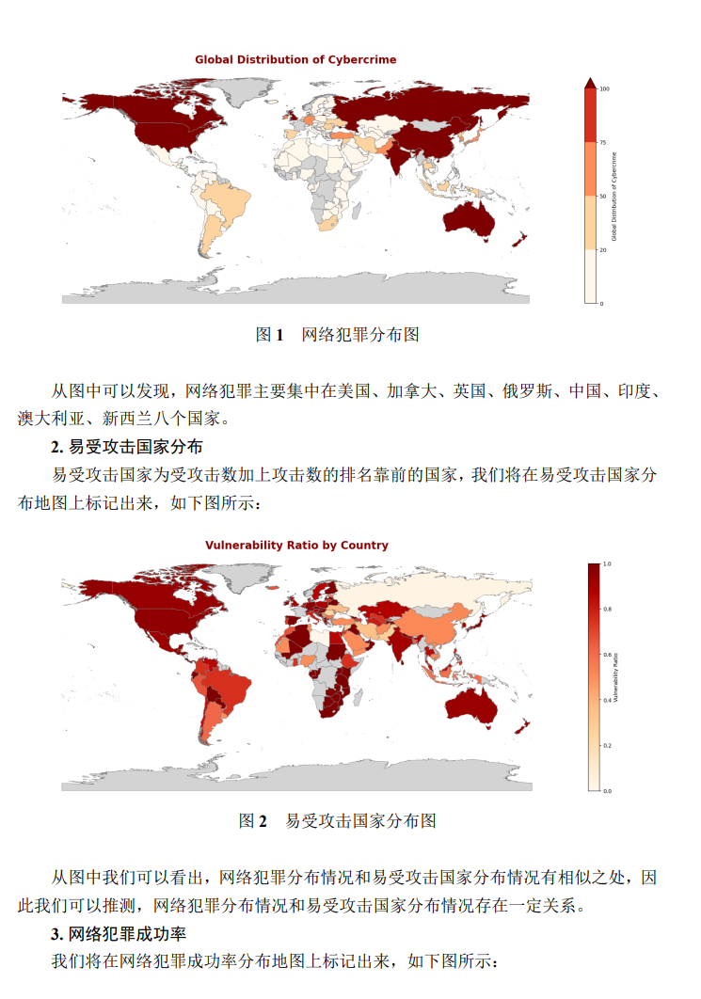
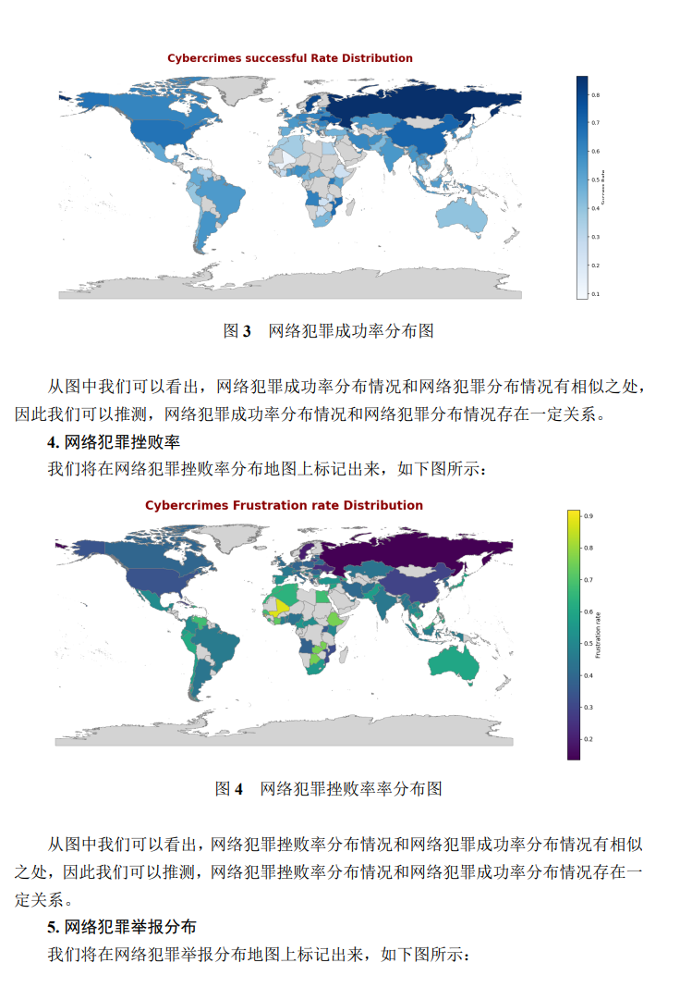
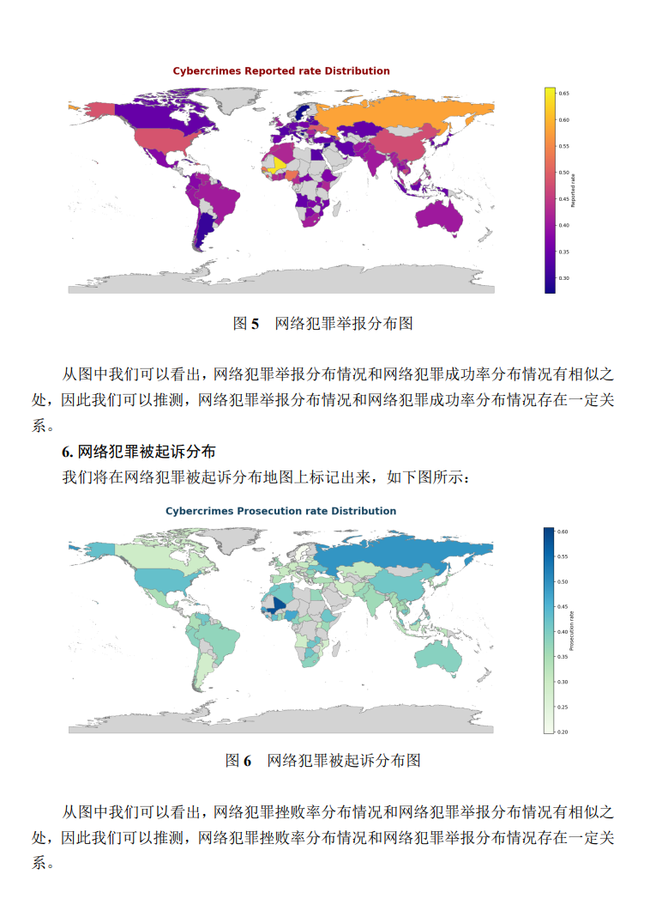

# 🎯 在各位想要参加数学建模美赛的时候，一定要找到认真负责且合适的队友！  
**祝大家比赛顺利！🎉**
 

经历比赛一周后，我仍然怀着沉重的心情回顾这次经历。打开 Cursor，往事历历在目。回顾他们的杰作。

### 📌 题目解析  

  
  
  

**汉化版**  

可以发现这道题是与 **网络犯罪** 相关，但这里的数据其实并不好采集，因为：  

- **网络犯罪数据极难统计** ，涉及**政治、军事、经济**等敏感领域。  
- **企业不会公开相关信息** ，例如某公司被黑客勒索数据，TA 可能根本不会对外披露，怕影响用户信任。  
- **只能依赖公开数据库**  进行定性分析，就像题中提到的：  

  

  

论文手开始发力了  

  

本来看到这里我还挺开心的，**毕竟不用去 GitHub 上下载数据再筛选**，  
但后来发现——**这些数据就是某些卖数学建模解题思路的公众号发放的错误版本！** 🫠  
也不知道她是在哪个公众号回复「数学建模 F 题免费领」得到的……

---

### 赛前一天下午六点的论文手成果  

  

####  **为什么是拍照赚钱？？？？？** 🤨  
这是什么东西？论文的第一页为什么会出现这些？？？  
专业的写成小数点后两位，全是编的
  

---

## 论文内容：G老师 直译 + 大量图片  

紧接着，就是 **长达 5 页的汉化翻译** 和 **GPT 翻译**
真的很让人抓狂第二天上午九点就要提交论文，但是论文里面为什么会出现汉语加G老师翻译过后的内容（但论文最后只能提交英文版！）。  

  
  
  

然后迎面而来的，全是 **3 页图片**。相信读过论文的朋友们一定会被论文手的专业程度震撼吧 🫣。  
不妨看看她到底写了什么（提取上面三张图片的文字）：

```plaintext
1. 从图中可以发现，网络犯罪主要集中在美国、加拿大、英国、俄罗斯、中国、印度、
澳大利亚、新西兰八个国家。
2. 易受攻击国家分布
   从图中可以看出，网络犯罪分布情况和易受攻击国家分布情况有相似之处，因此可推测二者存在一定关系。
3. 网络犯罪成功率
   从图中可以看出，网络犯罪成功率分布情况和网络犯罪分布情况有相似之处，因此可推测二者存在一定关系。
4. 网络犯罪挫败率
   从图中可以看出，网络犯罪挫败率分布情况和网络犯罪成功率分布情况有相似之处，因此可推测二者存在一定关系。
5. 网络犯罪举报分布
   从图中可以看出，网络犯罪举报分布情况和网络犯罪成功率分布情况有相似之处，因此可推测二者存在一定关系。
6. 网络犯罪被起诉分布
   从图中可以看出，网络犯罪挫败率分布情况和网络犯罪举报分布情况有相似之处，因此可推测二者存在一定关系。
```
* 大家有没有发现耶，像极了我们有些大学老师不熟练的读PPT或者是新生的组会发言


对不起，我实在没有能力在一处一处的指出这篇论文中的精华部分了，感兴趣的可以自行观看。

在我看到论文的时候是比赛前一天的晚上六点,也是我的生日


在此之前我每天在电脑前工作10小时以上，完成了画图，找数据，论文，处理数据的工作，直到我看到论文前，我还在调整图片。明天就是除夕，我本就丰富自己的大学生活才参加这次比赛，想着度过一个意义非凡的生日与年，但是他们的**工作态度**，让我在这天晚上，选择退出这次比赛


这样的做法确实不妥，可是我深刻的意识到这样做是对我的努力最大的尊重，发到github让大家看到，是对他们工作的"褒奖"

### Hints：
example.pdf是他们的工作成果
这里面的其他代码，文件，数据，都是比赛期间我整理的


💡 选队友一定要慎重！

💡 数学建模美赛不仅考验专业能力，更考验团队协作。

🎯 希望各位参加比赛的同学都能遇到认真负责的队友，取得好成绩！

## 最后

感谢论文手会用Latex而不是金山文档

感谢建模手会使用b站现学一天知识

没有你们我很难想象这篇论文是怎么出现的
